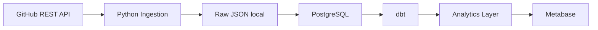

# GitLog

**Turning GitHub activity into structured data and actionable insights.**

## What is GitLog?

GitLog é um projeto de portfólio de Engenharia de Dados e Software que irá
transformar atividade real da API pública do GitHub em dados estruturados e análises.
O desenvolvimento é incremental, com entregas executáveis e verificáveis.

**Estado atual: Fase 4 — repositories, commits, issues e pull requests.** O pipeline consulta
a API real, preserva JSON por página, valida os campos e faz UPSERT no PostgreSQL
com auditoria por execução. Commits usam checkpoint por repositório, deduplicação
por repository ID + SHA e paginação com rate limit e retries. Issues e PRs têm
UPSERT e checkpoints de atualização separados, sem carregar PRs como issues. Transformações e
dashboard continuam planejados.

## Architecture

O fluxo até PostgreSQL está implementado para repositories, commits, issues e PRs. dbt, camada analítica
e Metabase representam etapas futuras:



Detalhes e limites de cada etapa: [arquitetura](docs/architecture.md).

## Tech Stack

| Camada | Tecnologia | Estado |
| --- | --- | --- |
| Pacote / CLI | Python 3.12+, argparse, setuptools | Configurado |
| Banco local | PostgreSQL 16, Docker Compose | Configurado |
| Qualidade | pytest, Ruff, Black | Configurado |
| Cliente GitHub | HTTPX síncrono | Implementado |
| Validação / configuração do pipeline | Pydantic, python-dotenv | Implementado |
| Persistência | Psycopg 3, migrações SQL | Repositories, commits, issues, PRs, checkpoints e auditoria |
| Transformação / visualização | dbt Core, Metabase | Planejado |
| Orquestração / data lake | Airflow, MinIO | Fases posteriores |

## Features

- Pacote instalável em ambiente virtual, com comandos de ajuda e versão.
- PostgreSQL com healthcheck, volume persistente e porta limitada ao localhost.
- Configurações de teste, lint e formatação centralizadas no `pyproject.toml`.
- Arquivo de exemplo de ambiente e exclusão de segredos e dados locais do Git.
- Cliente GitHub autenticado com paginação lazy, retries limitados e tratamento
  dos limites primário e secundário da API.
- Exceptions próprias e logs com campos estruturados, sem tokens ou payloads.
- Snapshots JSON imutáveis, validação de repositories e UPSERT pelo ID do GitHub.
- Migrações com checksum, role de ingestão restrita e auditoria transacional.
- Commits incrementais pela diferença entre SHAs, com checkpoint confirmado
  junto com os dados e a auditoria; reexecuções não criam duplicatas.
- Issues abertas/fechadas e PRs abertos/fechados/merged com identidade correta,
  snapshots completos e atualização incremental por entidade e repositório.

## Data Pipeline

`gitlog repositories` executa `GitHub → Python → Raw JSON → PostgreSQL` para os
repositórios configurados. `gitlog migrate` prepara o schema e a role de ingestão.
`gitlog commits` ingere o histórico da branch padrão e, nas próximas execuções,
somente a diferença desde o checkpoint. Também atualiza os metadados do repositório;
não exige uma execução prévia de `repositories`.
`gitlog issues` e `gitlog pull-requests` carregam as novas entidades com checkpoints
independentes. `gitlog all` executa repositories, commits, issues e PRs nessa ordem.
Consulte o [contrato do pipeline](docs/pipeline.md).

## Data Model

O schema `raw` contém `repositories`, `commits`, `issues`, `pull_requests`,
`ingestion_checkpoints` (commits), `entity_checkpoints` (issues/PRs) e
`pipeline_runs`. A tabela de controle de
migrações fica em `public`. Campos, constraints e limites estão no
[modelo de dados](docs/data-model.md).

## Getting Started

Pré-requisitos: Python 3.12 ou superior com `venv` e `pip`, Docker Engine em execução,
Docker Compose v2+ e GNU Make. Os comandos abaixo pressupõem Linux, macOS ou WSL.
Depois de clonar o repositório, entre no diretório do projeto:

```bash
cp .env.example .env
# Configure senhas diferentes para POSTGRES_PASSWORD e GITLOG_DB_PASSWORD.
# Configure GITHUB_TOKEN e GITLOG_REPOSITORIES para a ingestão.
docker compose up -d --wait
make setup
make migrate
make run
make commits
make issues
make pull-requests
# Ou execute todos os pipelines com: make ingest-all
```

`make setup` cria `.venv` e instala o projeto com as dependências de desenvolvimento.
Para escolher um interpretador, use `make setup PYTHON=python3.12`.
Se o sistema não oferecer `venv`/`pip`, instale esses componentes pelo gerenciador
de pacotes da sua distribuição antes do setup.

O token pode permanecer vazio para setup, ajuda, testes, PostgreSQL e migrações.
`make run` consulta a API real e grava snapshots e dados no PostgreSQL.
Para mostrar somente a ajuda, execute `.venv/bin/gitlog --help`.

## Environment Variables

| Variável | Uso |
| --- | --- |
| `GITHUB_TOKEN` | Obrigatório para criar `GitHubClient`; nunca versionar |
| `GITLOG_REPOSITORIES` | Lista `owner/repository` separada por vírgulas, sem duplicatas por capitalização |
| `GITLOG_RAW_DIR` | Diretório de snapshots; padrão `data/raw` |
| `GITLOG_DB_USER` | Role restrita de ingestão; padrão `gitlog_ingestion` |
| `GITLOG_DB_PASSWORD` | Senha da role de ingestão, obrigatória para migração e carga |
| `POSTGRES_HOST` | Host do PostgreSQL; padrão `127.0.0.1` |
| `POSTGRES_PORT` | Porta publicada no host; padrão `5432` |
| `POSTGRES_DB` | Banco inicial; padrão `gitlog` |
| `POSTGRES_USER` | Usuário de inicialização local; padrão `gitlog` |
| `POSTGRES_PASSWORD` | Obrigatória no Compose; substitua o exemplo em `.env` |

O Compose lê `.env` automaticamente. Os comandos de migração e ingestão
carregam `.env` do diretório atual sem sobrescrever variáveis já exportadas.
Ao usar `GitHubClient` diretamente em Python, defina `GITHUB_TOKEN` no ambiente;
a classe não carrega `.env` implicitamente.
Somente as três variáveis de inicialização `POSTGRES_DB`,
`POSTGRES_USER` e `POSTGRES_PASSWORD` são passadas ao container.

O usuário criado pela imagem oficial é administrador do banco local, usado pelas
migrações. `make migrate` provisiona uma role separada com `USAGE` no schema `raw`
e `SELECT`, `INSERT`, `UPDATE` nas sete tabelas. A ingestão usa essa role.
Essa configuração não é uma implantação de produção.

## Running locally

```bash
make up                  # Inicia PostgreSQL e aguarda o healthcheck
docker compose ps
docker compose exec postgres sh -c 'psql -U "$POSTGRES_USER" -d "$POSTGRES_DB"'
make migrate             # Aplica migrações e provisiona a role restrita
make run                 # Ingere os repositórios configurados usando a API real
make commits             # Histórico de commits e próximas cargas incrementais
make issues              # Issues abertas/fechadas, excluindo PRs
make pull-requests       # PRs com os campos de merge
make ingest-all          # Os quatro pipelines, com auditorias independentes
.venv/bin/gitlog commits --full-refresh  # Reconcilia todo o histórico alcançável
.venv/bin/gitlog --version
make down                # Para e remove containers; preserva o volume
```

`docker compose up -d` também funciona, mas retorna antes de garantir que o banco
esteja saudável. Se a porta 5432 estiver ocupada, altere `POSTGRES_PORT` em `.env`.
As variáveis de inicialização só criam usuário, senha e banco quando o volume está
vazio; mudar `.env` não altera as credenciais de um banco já inicializado.
Não use `docker compose down -v` se precisar preservar os dados.

### Using the GitHub client

Exemplo Python, após definir `GITHUB_TOKEN` no ambiente e executar `make setup`:

```python
from ingestion.client import GitHubClient

with GitHubClient() as github:
    repository = github.get("/repos/spring-projects/spring-boot")
    rate_limit = github.rate_limit
```

O exemplo consulta a API real e retorna JSON em memória. Não grava arquivos nem
tabelas. A API pública, parâmetros, política de retry e exemplos de paginação estão
documentados em [GitHub API Client](docs/github-client.md).

## Running tests

```bash
make test
make test-integration    # PostgreSQL temporário; GitHub continua simulado
make lint
make format-check
make check               # Lint, formatação e testes
make compose-check       # Valida o Compose usando .env.example, sem exibir senhas
make format              # Organiza imports e formata o código
```

Para executar `pytest` diretamente:

```bash
source .venv/bin/activate
pytest
```

Os testes verificam instalação, CLI, autenticação, timeout, erros HTTP, redirects,
paginação, rate limits e retries. Usam `httpx.MockTransport`, token fictício e relógio
simulado; o transporte HTTP real é bloqueado nos testes unitários e de integração.
`make test` pula os testes de banco quando não há configuração do runner.
`make test-integration` cria um projeto Compose isolado com porta dinâmica e
credenciais temporárias, executa os testes e remove seu container e volume.
Os testes cobrem UPSERT, rollback, auditoria, migrações, permissões, paginação,
incremental, concorrência, histórico reescrito e a CLI.
Os testes de issues/PRs cobrem páginas mistas, ID de issue diferente do ID de PR,
estados aberto/fechado/merged, repetição sem duplicação, atualização de registros,
checkpoints separados, falhas de raw/SQL/paginação e preservação da Fase 3 na migração.

## Dashboard

**GitLog Analytics** será desenvolvido no Metabase na Fase 7, depois de validar
o pipeline e a camada analítica. Nenhuma métrica de demonstração foi criada.

## Data Quality

O cliente valida JSON e o formato das páginas. Pydantic valida identidade,
contagens, flags e timestamps com fuso; o PostgreSQL aplica constraints e chave
primária pelo ID do GitHub. O JSON é preservado antes da validação de domínio.
Testes de qualidade dbt serão adicionados com a camada de transformação.

## Incremental Loading

Commits fixam o SHA da branch padrão antes de paginar. A primeira execução lê
todo o histórico; a próxima compara o checkpoint com a nova ponta. Datas antigas
em commits incorporados por merge não os excluem da carga. Se o SHA não mudou,
nenhuma página de commits é requisitada e as contagens são zero.

Dados, checkpoint e auditoria de sucesso são confirmados na mesma transação.
Histórico divergente, base indisponível ou mudança de branch provocam reconciliação
completa. `--full-refresh` força essa reconciliação; commits já observados são
preservados mesmo após force-push. A carga cobre a branch padrão, não todas as branches.

`records_extracted` conta registros de commits recebidos nas páginas processadas;
`records_loaded` conta commits distintos inseridos ou efetivamente atualizados.
Registros idênticos não são regravados. Veja a [decisão de incremental](docs/decisions/ADR-003-incremental-commits.md).

### Issues e Pull Requests

```bash
source .venv/bin/activate
python -m ingestion.main migrate
python -m ingestion.main issues
python -m ingestion.main pull-requests
python -m ingestion.main all
```

Os três comandos aceitam `--per-page 1..100` e `--full-refresh`. Para atualizar uma
instalação da Fase 3, execute `migrate`: a migração `003_issues_pull_requests.sql`
adiciona as tabelas e permissões sem alterar repositories, commits ou seus checkpoints.

O endpoint `/issues` inclui PRs. A presença da chave `pull_request` exclui o item
da tabela de issues, mesmo quando seu valor é nulo. Para PRs, esse endpoint serve
apenas à descoberta incremental: cada número selecionado é consultado em
`/pulls/{number}` para obter o ID real e os campos `merged_at`, `merge_commit_sha`
e `draft`. `merge_commit_sha` preenchido não significa, sozinho, que houve merge.

Cada entidade mantém um checkpoint por repository ID. A consulta usa `state=all`
e `since=checkpoint-5 minutos`, seguindo todas as páginas pelo `GitHubClient`.
A ordenação por criação evita que uma edição mude a posição do item durante a
paginação. O checkpoint registra o início da descoberta, somente após confirmar
dados e auditoria na mesma transação. Em falha, permanece no valor anterior.

As tabelas têm PK pelo ID da própria entidade e `UNIQUE (repository_id, number)`.
O UPSERT não regrava dados iguais e não substitui uma versão por outra com
`updated_at` anterior. As métricas contam os itens selecionados da entidade em
`records_extracted` e as identidades inseridas/alteradas em `records_loaded`.
Uma releitura da janela pode extrair registros conhecidos e carregar zero.

Em `all`, cada pipeline/repositório tem sua auditoria e transação; uma falha
individual auditável não impede os pipelines seguintes. O comando retorna 1 se
houver qualquer falha e 0 se todos terminarem com sucesso. `all` não executa
migrações automaticamente. Detalhes e limites: [Issues e PRs](docs/issues-pull-requests.md).

## Project Structure

```text
gitlog/
├── ingestion/
│   ├── __init__.py
│   ├── main.py              # CLI: migrate, repositories, commits, issues, pull-requests, all
│   ├── config.py
│   ├── logging_config.py
│   ├── db/                  # Runner de migrações e SQL versionado
│   ├── extractors/
│   ├── loaders/             # Snapshots JSON e PostgreSQL
│   ├── models/
│   ├── services/
│   └── client/
│       ├── __init__.py
│       ├── github_client.py
│       ├── rate_limit.py
│       └── exceptions.py
├── tests/
│   ├── conftest.py
│   ├── test_cli.py
│   ├── test_github_client.py
│   ├── test_rate_limit.py
│   ├── test_repositories.py
│   ├── test_commits.py
│   ├── test_issues_pull_requests.py
│   ├── fixtures/
│   └── integration/
├── scripts/
│   └── test_integration.py
├── docs/
│   ├── architecture.md
│   ├── data-model.md
│   ├── pipeline.md
│   ├── github-client.md
│   ├── issues-pull-requests.md
│   └── decisions/
│       ├── ADR-001-use-postgresql.md
│       ├── ADR-002-github-client.md
│       └── ADR-003-incremental-commits.md
├── docker-compose.yml
├── pyproject.toml
├── .env.example
├── .gitignore
├── Makefile
└── README.md
```

Diretórios de dbt, Airflow, dashboards e workflows de CI serão adicionados conforme
essas etapas forem implementadas.

## Roadmap

- [x] Fase 0: bootstrap Python, qualidade, documentação e PostgreSQL local.
- [x] Fase 1: GitHub API Client — autenticação, paginação, timeout, rate limit e retries.
- [x] Fase 2: repositories — API → Raw JSON → PostgreSQL.
- [x] Fase 3: commits — paginação, incremental e idempotência; validação do MVP.
- [x] Fase 4: issues e pull requests.
- [ ] Fase 5: ampliar qualidade, auditoria e recuperação de falhas.
- [ ] Fase 6: dbt — staging, dimensões, fatos e testes.
- [ ] Fase 7: dashboard Metabase; incluir contributors/languages antes dos KPIs dependentes.
- [ ] Fase 8: Airflow.
- [ ] Fase 9: MinIO.
- [ ] Fase 10: CI/CD com GitHub Actions.
- [ ] Fase 11: Spring Boot Analytics API.
- [ ] Fase 12: deploy em cloud.

Checkpoints, constraints e rastreabilidade necessários ao MVP foram
implementados nas fases 2–3; a Fase 5 amplia essas garantias.

## Future Improvements

Activity Score com fórmula documentada antes da implementação; releases, tags,
branches, workflows e deployments. Kafka, Spark, AWS S3/Glue/Athena/Redshift,
BigQuery, Databricks, Terraform e Kubernetes são possibilidades a avaliar,
sem compromisso de adoção ou implementação antecipada.

## License

Licença ainda não definida. Uma licença explícita deverá ser escolhida antes de
distribuir o projeto como software open source.
