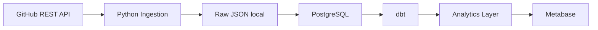

# GitLog

**Turning GitHub activity into structured data and actionable insights.**

## What is GitLog?

GitLog é um projeto de portfólio de Engenharia de Dados e Software que irá
transformar atividade real da API pública do GitHub em dados estruturados e análises.
O desenvolvimento é incremental, com entregas executáveis e verificáveis.

**Estado atual: Fase 1 — GitHub API Client.** O cliente HTTP autenticado possui
paginação, timeout, rate limit e retries, com testes usando mocks. O PostgreSQL
local está configurado. Ainda não há pipeline de ingestão, persistência de
entidades, transformações ou dashboard. O MVP ainda não está concluído.

## Architecture

O cliente Python já pode consultar a API GitHub explicitamente. A conexão com o
PostgreSQL será implementada nas próximas fases. Arquitetura planejada:



Detalhes e limites de cada etapa: [arquitetura](docs/architecture.md).

## Tech Stack

| Camada | Tecnologia | Estado |
| --- | --- | --- |
| Pacote / CLI | Python 3.12+, argparse, setuptools | Configurado |
| Banco local | PostgreSQL 16, Docker Compose | Configurado |
| Qualidade | pytest, Ruff, Black | Configurado |
| Cliente GitHub | HTTPX síncrono | Implementado |
| Validação / configuração do pipeline | Pydantic, python-dotenv | Planejado |
| Transformação / visualização | dbt Core, Metabase | Planejado |
| Orquestração / data lake | Airflow, MinIO | Fases posteriores |

## Features

- Pacote instalável em ambiente virtual, com comandos de ajuda e versão.
- PostgreSQL com healthcheck, volume persistente e porta limitada ao localhost.
- Configurações de teste, lint e formatação centralizadas no `pyproject.toml`.
- Arquivo de exemplo de ambiente e exclusão de segredos e dados locais do Git.
- Cliente GitHub autenticado com paginação lazy, retries limitados e tratamento
  dos limites primário e secundário da API.
- Exceptions próprias e logs com campos estruturados, sem tokens ou payloads.

## Data Pipeline

O primeiro pipeline será `GitHub → Python → Raw JSON → PostgreSQL`, apenas para
repositories e commits. A CLI ainda não executa requisições HTTP automaticamente.
Consulte o [plano do pipeline](docs/pipeline.md).

## Data Model

Ainda não existem tabelas ou schemas da aplicação. O [plano de modelagem](docs/data-model.md)
define as próximas entregas sem antecipar DDL ou migrações.

## Getting Started

Pré-requisitos: Python 3.12 ou superior com `venv` e `pip`, Docker Engine em execução,
Docker Compose v2+ e GNU Make. Os comandos abaixo pressupõem Linux, macOS ou WSL.
Depois de clonar o repositório, entre no diretório do projeto:

```bash
cp .env.example .env
# Edite POSTGRES_PASSWORD em .env e escolha uma senha local.
docker compose up -d --wait
make setup
make run
```

`make setup` cria `.venv` e instala o projeto com as dependências de desenvolvimento.
Para escolher um interpretador, use `make setup PYTHON=python3.12`.
Se o sistema não oferecer `venv`/`pip`, instale esses componentes pelo gerenciador
de pacotes da sua distribuição antes do setup.

O token pode permanecer vazio para setup, ajuda, testes e PostgreSQL.
Para usar `GitHubClient`, defina `GITHUB_TOKEN` no ambiente do processo.
`make run` continua mostrando a ajuda da CLI e não executa ingestão.

## Environment Variables

| Variável | Uso |
| --- | --- |
| `GITHUB_TOKEN` | Obrigatório para criar `GitHubClient`; nunca versionar |
| `GITLOG_REPOSITORIES` | Lista `owner/repository` separada por vírgulas; uso futuro |
| `POSTGRES_HOST` | Host para futuros clientes Python; localmente `127.0.0.1` |
| `POSTGRES_PORT` | Porta publicada no host; padrão `5432` |
| `POSTGRES_DB` | Banco inicial; padrão `gitlog` |
| `POSTGRES_USER` | Usuário de inicialização local; padrão `gitlog` |
| `POSTGRES_PASSWORD` | Obrigatória no Compose; substitua o exemplo em `.env` |

O Compose lê `.env` automaticamente. O cliente lê `GITHUB_TOKEN` do ambiente, mas
não carrega `.env` implicitamente. Configure a variável no terminal ou na execução
da IDE; um valor somente no arquivo não é suficiente para o cliente.
Somente as três variáveis de inicialização `POSTGRES_DB`,
`POSTGRES_USER` e `POSTGRES_PASSWORD` são passadas ao container.

O usuário criado pela imagem oficial é administrador do banco local. Uma role
restrita para a aplicação será criada junto com o loader, antes de usá-lo na
ingestão. Essa configuração não é uma implantação de produção.

## Running locally

```bash
make up                  # Inicia PostgreSQL e aguarda o healthcheck
docker compose ps
docker compose exec postgres sh -c 'psql -U "$POSTGRES_USER" -d "$POSTGRES_DB"'
make run                 # Ajuda do bootstrap
.venv/bin/gitlog --version
make down                # Para e remove containers; preserva o volume
```

`docker compose up -d` também funciona, mas retorna antes de garantir que o banco
esteja saudável. Se a porta 5432 estiver ocupada, altere `POSTGRES_PORT` em `.env`.
As variáveis de inicialização só criam usuário, senha e banco quando o volume está
vazio; mudar `.env` não altera as credenciais de um banco já inicializado.
Não use `docker compose down -v` se precisar preservar os dados.

### Using the GitHub client

Exemplo Python, após definir `GITHUB_TOKEN` no ambiente e executar `make setup`:

```python
from ingestion.client import GitHubClient

with GitHubClient() as github:
    repository = github.get("/repos/spring-projects/spring-boot")
    rate_limit = github.rate_limit
```

O exemplo consulta a API real e retorna JSON em memória. Não grava arquivos nem
tabelas. A API pública, parâmetros, política de retry e exemplos de paginação estão
documentados em [GitHub API Client](docs/github-client.md).

## Running tests

```bash
make test
make lint
make format-check
make check               # Lint, formatação e testes
make compose-check       # Valida o Compose usando .env.example, sem exibir senhas
make format              # Organiza imports e formata o código
```

Para executar `pytest` diretamente:

```bash
source .venv/bin/activate
pytest
```

Os testes verificam instalação, CLI, autenticação, timeout, erros HTTP, redirects,
paginação, rate limits e retries. Usam `httpx.MockTransport`, token fictício e relógio
simulado; o transporte HTTP real é bloqueado durante os testes unitários.
Testes de integração com PostgreSQL chegarão junto com o loader.

## Dashboard

**GitLog Analytics** será desenvolvido no Metabase na Fase 7, depois de validar
o pipeline e a camada analítica. Nenhuma métrica de demonstração foi criada.

## Data Quality

O cliente valida JSON e o formato das páginas; os testes também cobrem
empacotamento e comandos. Validação dos campos de domínio, constraints,
deduplicação e testes de qualidade dbt ainda serão implementados.

## Incremental Loading

Planejado para commits na Fase 3: estado persistido, checkpoints avançados somente
após carga bem-sucedida e UPSERT com chave composta de repositório e SHA.
Essa capacidade não está disponível na Fase 1.

## Project Structure

```text
gitlog/
├── ingestion/
│   ├── __init__.py
│   ├── main.py              # CLI de ajuda e versão
│   └── client/
│       ├── __init__.py
│       ├── github_client.py
│       ├── rate_limit.py
│       └── exceptions.py
├── tests/
│   ├── conftest.py
│   ├── test_cli.py
│   ├── test_github_client.py
│   └── test_rate_limit.py
├── docs/
│   ├── architecture.md
│   ├── data-model.md
│   ├── pipeline.md
│   ├── github-client.md
│   └── decisions/
│       ├── ADR-001-use-postgresql.md
│       └── ADR-002-github-client.md
├── docker-compose.yml
├── pyproject.toml
├── .env.example
├── .gitignore
├── Makefile
└── README.md
```

Pacotes `extractors`, `loaders`, `models` e `services` serão adicionados
conforme tiverem responsabilidades implementadas. O mesmo vale para `db`, `dbt`,
`airflow`, `dashboards`, `scripts`, `docker` e os workflows de CI.

## Roadmap

- [x] Fase 0: bootstrap Python, qualidade, documentação e PostgreSQL local.
- [x] Fase 1: GitHub API Client — autenticação, paginação, timeout, rate limit e retries.
- [ ] Fase 2: repositories — API → Raw JSON → PostgreSQL.
- [ ] Fase 3: commits — paginação, incremental e idempotência; validação do MVP.
- [ ] Fase 4: issues e pull requests.
- [ ] Fase 5: ampliar qualidade, auditoria e recuperação de falhas.
- [ ] Fase 6: dbt — staging, dimensões, fatos e testes.
- [ ] Fase 7: dashboard Metabase; incluir contributors/languages antes dos KPIs dependentes.
- [ ] Fase 8: Airflow.
- [ ] Fase 9: MinIO.
- [ ] Fase 10: CI/CD com GitHub Actions.
- [ ] Fase 11: Spring Boot Analytics API.
- [ ] Fase 12: deploy em cloud.

Checkpoints, constraints e rastreabilidade necessários ao MVP devem ser
implementados nas fases 2–3; a Fase 5 amplia essas garantias.

## Future Improvements

Activity Score com fórmula documentada antes da implementação; releases, tags,
branches, workflows e deployments. Kafka, Spark, AWS S3/Glue/Athena/Redshift,
BigQuery, Databricks, Terraform e Kubernetes são possibilidades a avaliar,
sem compromisso de adoção ou implementação antecipada.

## License

Licença ainda não definida. Uma licença explícita deverá ser escolhida antes de
distribuir o projeto como software open source.
