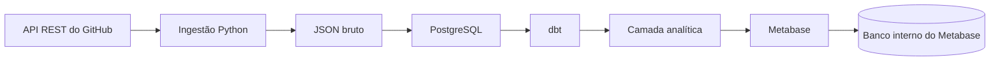

# Arquitetura do GitLog

## Estado atual — Fases 6 e 7

O pacote `ingestion` fornece ajuda, versão, migrações e ingestão via `argparse`.
Ajuda e versão não abrem conexões; `repositories` executa a ingestão configurada.
`commits` executa ingestão incremental com checkpoint persistido por repositório.
`issues` e `pull-requests` compartilham o pipeline incremental por atualização,
mantendo tabelas e checkpoints separados. `all` executa os quatro pipelines.
O subpacote `ingestion.client` usa HTTPX para consultas GET explícitas ao GitHub,
com sessão reutilizável, paginação, tratamento de erros e esperas limitadas.
`rate_limit.py` interpreta os headers; `exceptions.py` define os erros públicos.
`extractors.repositories` consulta cada repositório; `loaders.raw_loader` preserva
o JSON antes da validação em `models.github_models`. O serviço coordena essas
etapas e o loader PostgreSQL faz UPSERT e confirma o sucesso da auditoria na mesma
transação. O serviço de commits fixa a referência da branch padrão, preserva as
páginas completas e usa comparação de SHAs para incremental. O checkpoint participa
da transação de carga. A configuração usa Pydantic e a conexão usa Psycopg 3.
`pyproject.toml` configura empacotamento, pytest, Ruff e Black. O Makefile usa o
ambiente virtual local sem exigir ativação manual.

O Docker Compose inicia PostgreSQL 16 com volume nomeado e healthcheck usando
`pg_isready`. A porta é publicada apenas em `127.0.0.1`. A imagem oficial usa
root durante a preparação das permissões do volume e executa o servidor como
usuário `postgres`; não se força um UID que prejudique a inicialização.

O healthcheck verifica disponibilidade do servidor, não migrações, permissões da
aplicação ou completude de dados. O usuário de bootstrap é administrador local;
`migrate` provisiona a role de ingestão com `USAGE` no schema `raw` e permissões
de leitura, inserção e atualização nas tabelas de repositories, commits, issues, PRs, checkpoints
e auditoria.
Migrações SQL empacotadas são aplicadas em transação, com lock e checksum.

## Analytics e visualização

O projeto dbt transforma as quatro fontes raw em staging, intermediate e analytics.
As views normalizam identidades, tipos e UTC; as tabelas dimensionais e fatos
sustentam o dashboard. A role dbt lê raw e escreve somente nos schemas sob sua
responsabilidade. O Metabase usa outra role, restrita a SELECT em analytics.

O Compose inicia três serviços permanentes: PostgreSQL GitLog, PostgreSQL interno
do Metabase e Metabase. O serviço dbt usa profile tools, executado sob demanda.
A aplicação BI mantém usuários/perguntas/dashboard em volume separado; não usa
H2 embarcado nem reutiliza o banco operacional como banco interno.

Definições versionadas em dashboard/cards.json e SQL são aplicadas pela API da
imagem fixa. O dashboard consome marts; transformação, UTC e duração de merge
permanecem no dbt. Sem história de eventos, snapshots atuais não fornecem
transições completas, histórico de estrelas ou histórico de linguagens.

Airflow, MinIO e Spring Boot permanecem fases futuras. A sequência atual é manual:
ingestão → dbt run → dbt test → consulta do dashboard.

## Configuração e segurança

`.env.example` contém somente placeholders. `.env`, variações de ambiente,
dados locais e chaves são ignorados pelo Git. O token do GitHub não é passado ao
PostgreSQL. A CLI carrega `.env` sem substituir variáveis exportadas; o cliente
HTTP continua lendo apenas o ambiente. Entradas são validadas, SQL usa parâmetros
e identificadores compostos pelo Psycopg, e os logs JSON incluem somente campos
operacionais selecionados. Erros são registrados pela classe, sem seus payloads.

As dependências de desenvolvimento têm intervalos de versão no `pyproject.toml`;
dbt Core/adaptador e a imagem Metabase têm versões fixadas; dependências
transitivas ainda não possuem lockfile. A imagem fixa a versão principal do PostgreSQL, mas
recebe atualizações da tag. Isso permite correções sem prometer builds idênticos;
fixação por lockfile/digest poderá ser adotada na fase de CI/CD.

## Referências

- [Especificação de serviços do Docker Compose](https://docs.docker.com/reference/compose-file/services/)
- [Imagem oficial PostgreSQL](https://hub.docker.com/_/postgres)
- [Guia oficial de pyproject.toml](https://packaging.python.org/en/latest/guides/writing-pyproject-toml/)
- [ADR-001: PostgreSQL](decisions/ADR-001-use-postgresql.md)
- [ADR-002: cliente GitHub síncrono](decisions/ADR-002-github-client.md)
- [Contrato do cliente](github-client.md)
