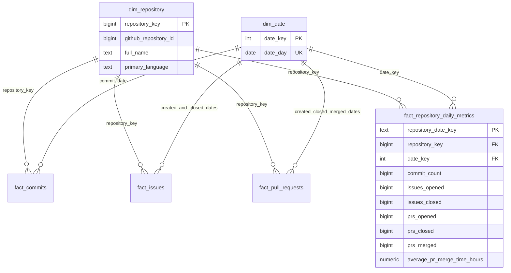

# Modelo de dados

**Estado: Fases 6–7.** A migração `001_repositories.sql` cria o schema `raw` com
repositories e auditoria; `002_commits.sql` adiciona commits e checkpoints;
`003_issues_pull_requests.sql` adiciona issues, PRs e seus checkpoints temporais.
`004_quality_observability.sql` reforça integridade e adiciona métricas de execução.
`public.gitlog_schema_migrations` registra nome,
checksum SHA-256 e data de aplicação de cada migração.

## Entidades do MVP

| Entidade | Identidade | Estratégia |
| --- | --- | --- |
| Repository | ID do GitHub | UPSERT dos atributos atuais |
| Commit | Repository ID + SHA | UPSERT sem duplicar commits dentro do repositório |
| Ingestion checkpoint de commits | Repository ID | Branch + SHA da última ponta carregada com sucesso |
| Pipeline run | ID da execução | Rastrear início, fim, status, contagens e erro sanitizado |

## `raw.repositories`

Uma linha por ID estável do GitHub, atualizada por UPSERT. Renomear o repositório
mantém a identidade; `full_name` possui índice, sem unicidade. O estado atual não
é substituído por uma extração com `ingested_at` anterior.

| Colunas | Regra |
| --- | --- |
| `id`, `node_id`, `name`, `full_name`, `owner` | Identidade obrigatória; `id` é bigint positivo e chave primária |
| `description`, `language` | Texto anulável |
| `created_at`, `updated_at`, `pushed_at` | Timestamps com fuso; somente `pushed_at` aceita nulo |
| `stars`, `forks`, `watchers`, `open_issues` | Bigints não negativos |
| `default_branch`, `archived`, `visibility` | Obrigatórios; visibilidade public/private/internal |
| `ingested_at`, `raw_path`, `pipeline_run_id` | Última observação, snapshot e auditoria da última mudança; FK para `pipeline_runs` |

O modelo mapeia `owner.login`, `stargazers_count`, `forks_count`,
`subscribers_count` e `open_issues_count`. `watchers` usa `subscribers_count`.
Campos desconhecidos permanecem no snapshot original e são ignorados pelo modelo.

## `raw.pipeline_runs`

Cada tentativa de ingestão de um repositório recebe um UUID e registra
`pipeline_name`, `repository`, `started_at`, `finished_at`, `status`,
`records_extracted`, `records_loaded`, `records_skipped`, `duration_ms`, `raw_path`
e `error_message`. `records_skipped` é gerado como extraídos menos carregados
em sucesso; vale zero em falha. `duration_ms` é não negativo para execuções
finalizadas e nulo em `RUNNING`. Falhas têm zero carregados.
Um índice por repositório e início facilita consultar execuções recentes.

As constraints permitem `RUNNING` sem fim, `SUCCESS` com fim e sem erro, e
`FAILED` com fim e erro. Contagens são não negativas e a carga não pode exceder a
extração. O erro contém somente o nome da classe da exceção. `raw_path` pode ser
nulo quando a falha ocorre antes da preservação do JSON.

O UPSERT e a transição para `SUCCESS` usam a mesma transação. Uma falha de carga
faz rollback e depois registra `FAILED`; se o banco ficar indisponível, a execução
pode permanecer `RUNNING`. Arquivos já publicados permanecem disponíveis após
falhas de validação ou SQL. Caminhos relativos são resolvidos a partir do diretório
de execução; configure `GITLOG_RAW_DIR` absoluto quando precisar de referência estável.

## `raw.commits`

Chave primária composta `(repository_id, sha)` com FK para `raw.repositories`.
O mesmo SHA em dois repositórios representa duas linhas distintas. Armazena
mensagem completa, nomes/emails/datas de autor e committer, logins GitHub opcionais
e lista de SHAs dos pais. Identidades Git e contas GitHub podem estar ausentes;
esses campos aceitam nulo. Mensagens vazias são válidas.

`ingested_at`, `raw_path` e `pipeline_run_id` apontam para a carga e página JSON
originais. O UPSERT só atualiza quando algum campo da origem mudou; uma releitura
idêntica preserva a proveniência. Índice por repository ID e data do committer
suporta consultas temporais. Estatísticas de arquivos e linhas não são coletadas.

## `raw.ingestion_checkpoints`

Uma linha por repository ID para o pipeline de commits da branch padrão:
`branch`, `head_sha`, `updated_at`, `pipeline_run_id`. O checkpoint não usa datas
de autoria ou de commit. Renomear o repositório mantém a identidade; mudar a
branch padrão inicia reconciliação completa e atualiza a mesma linha.

O serviço mantém um advisory lock de sessão por repository ID desde a leitura
do checkpoint até a conclusão. Outra execução concorrente falha sem sobrescrever
o estado. O PostgreSQL libera o lock quando a sessão termina. Commits, metadados
do repositório, checkpoint e auditoria de sucesso usam uma única transação.

Em auditorias `commit_ingestion`, `records_extracted` conta os itens recebidos nas
páginas de dados, incluindo repetições. `records_loaded` conta chaves distintas
inseridas ou alteradas; uma falha deixa zero registros carregados. Respostas de
metadados e comparações que acionam fallback não entram nas contagens.
`raw_path` aponta ao manifesto em sucesso e ao diretório dos documentos
preservados em falha. Um repositório vazio retorna sucesso com zero e não cria checkpoint.

## Issues, Pull Requests e checkpoints temporais

`raw.issues`: `id`, `number`, `repository_id`, `title`, `state`, `author_login`,
`created_at`, `updated_at`, `closed_at`, `comments_count`.

`raw.pull_requests`: os mesmos campos, sem `comments_count`, mais `merged_at`,
`merge_commit_sha` e `draft`. O ID vem do endpoint de PR, nunca da issue associada.

Ambas possuem PK `id`, `UNIQUE (repository_id, number)` e FK para repositories,
além de `ingested_at`, `raw_path` e `pipeline_run_id` para proveniência. Contagens
são não negativas, IDs/números positivos e `state` é open/closed. PR merged
exige estado closed. Autor, fechamento e campos de merge aceitam nulo.
Há índices por repository ID e data de atualização.

`raw.entity_checkpoints` armazena `repository_id`, `entity`, `watermark`,
`updated_at` e `pipeline_run_id`; a PK composta separa Issues e PRs. Commits
mantêm seu checkpoint por SHA na tabela original. [Fluxo e garantias](issues-pull-requests.md).

## Camada analítica dbt

Os modelos staging e intermediate são views nos schemas homônimos. Os marts são
tabelas no schema `analytics`. Veja [execução e contratos](analytics.md).

| Model | Granularidade | Conteúdo |
| --- | --- | --- |
| `stg_github_repositories` | ID do repositório | Atributos atuais e timestamps UTC |
| `stg_github_commits` | repository + SHA | Identidade, login opcional e data do commit com proveniência |
| `stg_github_issues` | ID de issue | Estado, criação, fechamento e comentários |
| `stg_github_pull_requests` | ID de PR | Estado, draft, criação, fechamento e merge |
| `int_repository_events` | Evento observado | Commit, abertura, último fechamento e merge |
| `int_repository_date_bounds` | Repositório | Limites do calendário por repositório |
| `dim_repository` | Repositório (tipo 1) | repository_key, github_repository_id, name, full_name, owner, primary_language, created_at, current_stars/current_forks |
| `dim_date` | Data UTC | date_key YYYYMMDD, date_day, ano, trimestre, mês, semana/ano ISO, dia ISO e fim de semana |
| `fact_commits` | repository + SHA | commit_key, repository_key, commit_timestamp, commit_date, timestamp_source, author_login, sha |
| `fact_issues` | Issue | issue_key, repository_key, github_issue_id, issue_number, title, state, author_login, created/updated/closed, comments_count |
| `fact_pull_requests` | PR | pull_request_key, repository_key, ID/número, título, state, author_login, datas, draft, merged, merge_commit_sha, merge_time_hours |
| `fact_repository_daily_metrics` | repository + date | commit_count, issues_opened/closed, prs_opened/closed/merged, soma e média de horas até merge |

As datas de fatos se relacionam a `dim_date.date_day`; a tabela diária também
contém `date_key`. Datas de fechamento/merge são opcionais; um commit pode não ter
nenhuma data disponível. `repository_key` reutiliza o ID estável do GitHub, sem
hash artificial. Stars/forks atuais não permitem uma série histórica. Linguagem
é o atributo atual, inclusive quando usado como filtro de eventos antigos.

As relações são testadas pelo dbt; não são foreign keys físicas criadas pelo dbt.
Os schemas raw continuam com suas constraints PostgreSQL. A métrica de média
considera somente PRs efetivamente merged e usa horas corridas. Mudanças de estado
intermediárias e exclusões não podem ser reconstruídas de snapshots atuais.

## Garantias adicionadas na Fase 5

Datas finitas e cronologia válida são verificadas por constraints; títulos e
identidades obrigatórias não podem ser vazios. Arrays de SHAs de pais também são
validados. O checkpoint de commits possui FK composta para o SHA do mesmo
repositório. Triggers diferidas exigem auditoria de sucesso do pipeline correto
para gravar checkpoints. A leitura dos checkpoints rejeita auditoria inconsistente
e watermarks futuros. Métricas, comportamento em falha e limites estão no
[contrato operacional](pipeline.md).
