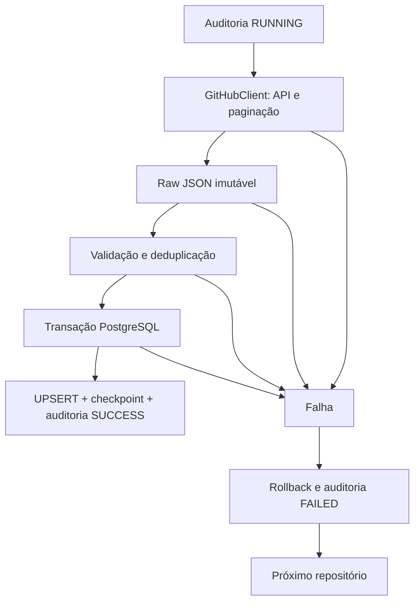

# Pipeline: confiabilidade e operação

Após a ingestão descrita aqui, as Fases 6–7 executam [dbt](analytics.md) e
[GitLog Analytics no Metabase](dashboard.md). A confiabilidade da ingestão
continua com as garantias abaixo.

A Fase 5 aprimora os quatro pipelines existentes: `repositories`, `commits`,
`issues` e `pull-requests`. Não introduz novas fontes, transformações ou dashboards.

## Fluxo



Cada par repositório/pipeline tem uma auditoria própria. O início é persistido
antes da chamada à API. A página recebida é preservada integralmente antes de
validar seus registros. O loader carrega somente campos tipados; campos extras
continuam disponíveis no arquivo raw. A transação final confirma metadados,
registros, checkpoint e `SUCCESS` juntos.

Raw usa arquivos locais imutáveis publicados após `fsync`, com partições UTC.
Commits, issues e PRs possuem diretórios por entidade/repositório/data/run UUID,
páginas e manifesto; repositories possui um snapshot por execução. Raw e banco
não participam da mesma transação. Após falha, páginas preservadas permanecem
para diagnóstico; pode não haver manifesto se a paginação não terminou.

## Data Quality e integridade

Validação Pydantic ocorre antes da carga e constraints PostgreSQL protegem a
persistência, inclusive contra gravações diretas:

- IDs e números obrigatórios, inteiros positivos; contagens não negativas.
- Datas com timezone na entrada, datas finitas no banco; atualização, fechamento
  e merge não podem anteceder a criação de issues/PRs. Commits podem ter datas
  autorais antigas e fora de ordem, pois a extração usa SHAs, não essas datas.
- Estado de issues/PRs limitado a `open` e `closed`; um PR merged deve estar fechado.
- SHA e SHAs dos pais: 40 caracteres hexadecimais minúsculos.
- Campos necessários ausentes, títulos vazios e identidades inconsistentes falham.
  Autores removidos, datas opcionais e outros valores nulos permitidos pelo modelo
  da fonte continuam válidos; o pipeline não inventa valores.
- Foreign keys ligam entidades aos repositories e à auditoria. O checkpoint de
  commits referencia um commit já carregado **do mesmo repositório**.
- Triggers diferidas verificam, no commit, que checkpoints novos ou alterados
  referenciam uma auditoria `SUCCESS` do pipeline correto.

Não há FK de `merge_commit_sha` ou `parent_shas` para commits: esses SHAs podem
estar fora do histórico coletado. `full_name` não é chave de identidade, pois
nomes de repositórios mudam e podem ser reutilizados; a chave é o ID do GitHub.

A migração `004_quality_observability.sql` adiciona as constraints, a duração e
as métricas. Não modifica migrações anteriores. Dados que violam as novas
constraints fazem a migração falhar e reverter; corrija a causa antes de repetir.
Checkpoints legados também são validados ao serem lidos pelo pipeline e pelo
`status`. Nenhum reset automático oculta inconsistências.

## Deduplicação e idempotência

| Entidade | Chave | Tratamento de repetição |
| --- | --- | --- |
| Repositories | ID GitHub | Compara campos da fonte; ignora resposta mais antiga |
| Commits | `(repository_id, sha)` | Deduplica páginas e faz UPSERT somente se mudou |
| Issues | ID GitHub; único `(repository_id, number)` | Seleciona ocorrência mais recente e usa `updated_at` no UPSERT |
| Pull requests | ID da resposta `/pulls`; único `(repository_id, number)` | Mesmo tratamento temporal, separado de issues |

Conteúdos imutáveis conflitantes para o mesmo SHA dentro da carga ou um ID de
issue/PR associado a números diferentes na mesma carga provocam rollback.
Dados idênticos mantêm o arquivo e a auditoria da última mudança da fonte.
Em repositories, `ingested_at` acompanha a observação mais recente mesmo quando
idêntica: isso impede que uma resposta antiga ainda em trânsito sobrescreva o
estado. Esse avanço operacional não aumenta `records_loaded`.

`/issues` contém PRs. A presença da chave `pull_request`, mesmo com valor nulo,
determina a separação. Issues rejeita esses registros; PRs consulta `/pulls/{number}`
e usa o ID da resposta de PR. As tabelas possuem unicidade individual; não há
constraint entre elas. `status` verifica sobreposição de `(repository_id, number)`
para revelar contaminação, inclusive por SQL administrativo. A ingestão normal
mantém a separação por filtro e modelos próprios.

Idempotência aplica-se às linhas de negócio. Cada tentativa gera nova auditoria
e novos snapshots raw. Registros removidos da fonte não são apagados automaticamente;
reconciliação de exclusões/transferências não faz parte desta fase.

## Checkpoints

Um advisory lock por entidade e repository ID protege a leitura e atualização
contra duas execuções concorrentes do mesmo pipeline. Entidades distintas podem
ser processadas independentemente. Conflito de lock falha aquela execução, sem
sobrescrever o checkpoint de outra sessão.

| Situação | Commits | Issues / PRs |
| --- | --- | --- |
| Primeira carga | Histórico da branch padrão fixado em SHA | Descoberta completa de abertos e fechados |
| Incremental | Compare paginado entre checkpoint e ponta fixa | `since = watermark - 5 minutos` |
| Sucesso | Confirma SHA carregado | Confirma instante anterior à descoberta, monotonicamente |
| Nenhuma mudança | Mesma ponta: zero extraídos/carregados | Janela vazia ou sobreposição: zero carregados |
| Repositório/janela vazia | Sem histórico inicial, não cria checkpoint | Janela concluída avança watermark, mesmo sem registros |
| Falha de página, raw, validação ou SQL | Mantém checkpoint anterior | Mantém checkpoint anterior |
| Checkpoint inconsistente | Falha antes de ingerir páginas | Falha antes de ingerir páginas |

A sobreposição temporal absorve mudanças próximas da fronteira; não oferece
snapshot transacional da API. O watermark não depende da data máxima recebida.
Uma janela incompleta jamais é considerada concluída. Watermarks futuros além
de cinco minutos são rejeitados; mantenha relógios da aplicação e banco alinhados.

Commits reconcilia todo o histórico quando muda a branch, a base deixa de estar
acessível ou o histórico diverge. Commits já armazenados são mantidos. Use
`--full-refresh` para reconciliar os registros disponíveis; essa opção não ignora
um checkpoint inconsistente. Repositories consulta o estado atual a cada execução
sem checkpoint separado. Mais detalhes: [commits](decisions/ADR-003-incremental-commits.md)
e [issues/PRs](issues-pull-requests.md).

## Retries e paginação

Todos os extractors usam `GitHubClient`, sem duplicar lógica de HTTP. O cliente
segue `Link: rel=next`, valida origem, detecta ciclos e limita páginas. Resposta
curta não substitui o link como critério de término. Limites e detalhes estão no
[contrato do cliente](github-client.md).

O padrão é até três retries além da tentativa inicial, com backoff para erros
transitórios. Rate limits primário/secundário respeitam `Retry-After` e reset,
com espera máxima de 300 segundos por pausa; uma espera maior falha explicitamente.
Timeouts e erros transitórios usam o orçamento de retries existente. Erros de
autenticação, payload inválido e falhas SQL não recebem retry indiscriminado.
Após corrigir a causa, reexecute: raw, UPSERT e checkpoint permitem recuperação.

## Falhas e recuperação

A unidade atômica é um repositório de uma entidade. Se a auditoria de falha puder
ser persistida, a carga é revertida, registra `FAILED` e continua no próximo
repositório. `all` executa repositories, commits, issues e PRs nessa ordem; falhas
individuais não revertem sucessos independentes. A CLI termina com código 1 se
qualquer carga falhar.

Se o banco estiver indisponível no início, a chamada à API não começa. Se perder
a conexão durante a transação ou não conseguir persistir o resultado, a execução
aborta: continuar sem auditoria confiável esconderia falhas. O resumo usa
`UNKNOWN` e carregados desconhecidos (`?`) quando a auditoria de falha não pode
ser confirmada. `UNKNOWN` é um diagnóstico de processo, não um status persistido.

Uma queda do processo/conexão pode deixar `RUNNING`, ou uma transação pode ter
sido confirmada antes da conexão cair. Por isso o operador deve consultar `status`
quando o banco voltar, conferir a auditoria e os arquivos raw, e reexecutar usando
o último checkpoint confirmado. Não há reset automático, marcação por idade nem
quarentena por registro. Um payload inválido reprova toda a unidade atômica.
`RUNNING` indica auditoria pendente; não prova que um processo ainda está vivo.

## Auditoria, métricas e logs

`raw.pipeline_runs` contém UUID, pipeline, repositório, início/fim, status, caminho
raw, classe de erro e as métricas abaixo:

- `records_extracted`: registros recebidos da entidade, incluindo repetições.
  Descoberta de PRs conta entradas com marcador; issues conta as entradas sem ele.
- `records_loaded`: chaves distintas inseridas ou alteradas; zero em rollback.
- `records_skipped`: extraídos menos carregados **apenas em sucesso**. Inclui
  duplicatas, releituras idênticas e versões antigas. Em falha é zero, pois não
  confunde registros revertidos/não processados com registros ignorados válidos.
- `duration_ms`: tempo monotônico da execução até finalização; auditorias antigas
  recebem duração calculada de início/fim. Permanece nulo enquanto `RUNNING`.

`records_failed` não foi adicionado: a estratégia não rejeita linhas isoladas;
atribuir uma contagem a um lote revertido seria ambíguo. Status, classe de erro e
contagem extraída descrevem a falha. O contador `records_skipped` é gerado pelo
banco para manter a relação entre métricas consistente.

Logs JSON em stderr usam allowlist, com evento, timestamp UTC, componente,
repositório, entidade e run ID. Chamadas HTTP e retries herdam a correlação da
execução. Não registram tokens, senhas, corpo dos erros ou payloads. O evento
`pipeline.summary` reúne métricas e status; a CLI imprime um resumo em stdout:

```text
Repository: octocat/Hello-World | Entity: issues | Extracted: 152 | Loaded: 150 | Skipped: 2 | Status: SUCCESS | Duration: 8.400s
```

A duração do resumo inclui a conclusão do serviço e pode diferir ligeiramente
da duração persistida, registrada dentro da transação.

## Comando status

Após `make migrate`, execute no ambiente virtual:

```bash
python -m ingestion.main status
python -m ingestion.main status --json
# Ou: make status
```

Usa apenas configuração PostgreSQL e uma transação read-only com snapshot
consistente. Não chama GitHub nem exige token/lista de repositórios. Exibe a última
execução global, a última execução de cada pipeline/repositório que já possui
auditoria, checkpoints, todas as auditorias `RUNNING` pendentes (mesmo se houver
sucesso posterior) e contagem de sobreposições issue/PR. Pipeline nunca executado
não aparece. O JSON expõe UUIDs e timestamps para investigação.

O código 0 significa que a consulta funcionou, inclusive quando ela mostra
`FAILED`, `RUNNING` ou checkpoint `INCONSISTENT`; não é um healthcheck binário.
Falha de conexão/configuração/consulta retorna 1. A consulta não altera estados.

## Testes e cobertura

```bash
make check             # Ruff, Black e testes; integração pula sem banco isolado
make test-integration  # PostgreSQL real em Compose temporário; remove ao terminar
make coverage          # Ambas as suítes, linhas e branches de ingestion/
```

GitHub é simulado e a rede HTTP real é bloqueada nos testes. O runner usa banco
`gitlog_test`, credenciais aleatórias e porta dinâmica, sem usar o banco local do
projeto. Os testes cobrem paginação, retries 500/429, payload inválido, raw,
UPSERT, estados, falhas parciais, constraints, migração com dados antigos,
checkpoints vazios/inalterados/inconsistentes, perda de conexão, logs e status.

A cobertura combina testes unitários e PostgreSQL, priorizando decisões de
checkpoint, rollback e classificação de erros. Subprocessos CLI de smoke tests
não são instrumentados; chamadas diretas à CLI são medidas. Não há meta artificial
de 100%. Os testes não demonstram disponibilidade da API externa nem simulam
queda física do servidor no instante exato de confirmação da transação.

Validação da Fase 5: 233 testes unitários e 116 testes de integração passaram.
Ruff e Black aprovados. A medição de `ingestion/` cobriu 98,7% das linhas e 94,7%
dos branches (98% combinado, arredondado pelo coverage.py). Os containers e volumes
temporários usados nessa validação foram removidos.
